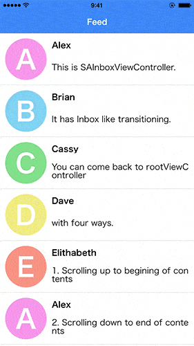

# SAInboxViewController

[](https://developer.apple.com/iphone/index.action)
[](https://developer.apple.com/swift)
[](http://cocoapods.org/pods/SAInboxViewController)
[](http://cocoapods.org/pods/SAInboxViewController)



SAInboxViewController realizes Inbox like view transitioning.

## Usage

To run the example project, clone the repo, and run `pod install` from the Example directory first.

## Requirements

## Installation

SAInboxViewController is available through [CocoaPods](http://cocoapods.org). To install
it, simply add the following line to your Podfile:

```ruby
pod "SAInboxViewController"
```

## Author

suzuki-taiki, suzuki_taiki@cyberagent.co.jp

## License

SAInboxViewController is available under the MIT license. See the LICENSE file for more info.
